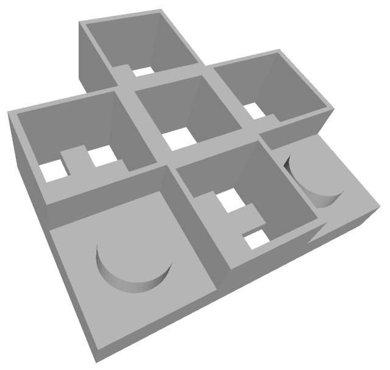
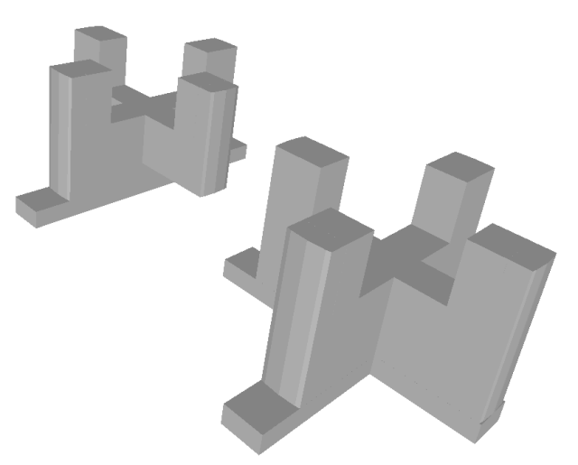
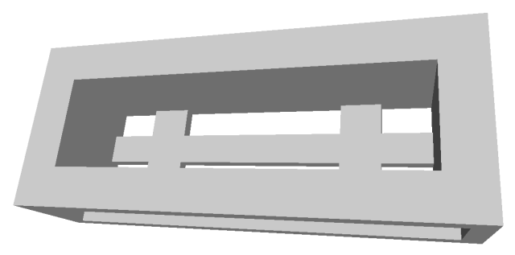
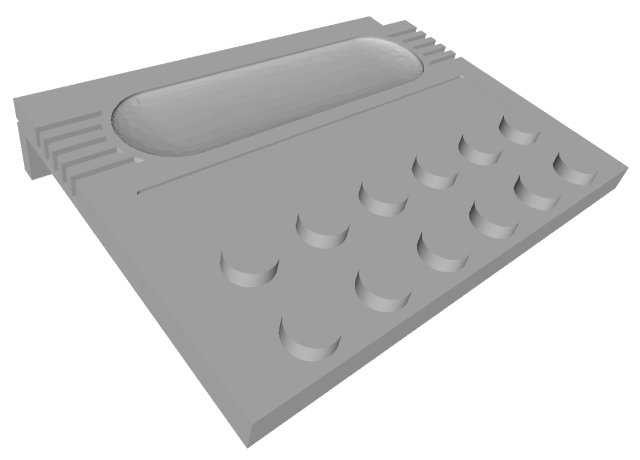

# Support parts

Especially the buttons need some kind of support to attach nicely to the
Lego parts. But also the charging port needs a solid attachment.

This uses 4 pcs 6x6x9mm tactile swiches, two pcs 6x6x8mm and two pcs
6x6x13mm.

## Direction pad

The direction pad needs to accommodate four 6x6x9mm tactile switches.

Download the [STL file for the DPad support](./dpad_support.stl).

## A/B buttons

The A and B buttons use 6x6x13mm switches and sit inside those round
Lego container pieces and get one button support part each.

Download the [STL file for the A/B buttons support](./button_a_b_support.stl).

## Start/Select buttons

The start and select buttons use one common part to support both
6x6x8mm tactile switches. Currently, it's designed to be used with a
2x1 plate instead of the round wheel originally being used in the
model.

Download the [STL file for the Start/Select buttons support](./button_start_select_support.stl).

## USB-C charging fake cartridge

The USB-C charger board glues to a small fake cartridge case which will nicely
expose the USB-C port for convenient charging. Using a 500mAh battery taken from
a Vape, the device runs about one hour before needing to be recharged.

Download the [STL file for the fake USB-C charger cartridge](./cartridge_usb_c_charger.stl).
